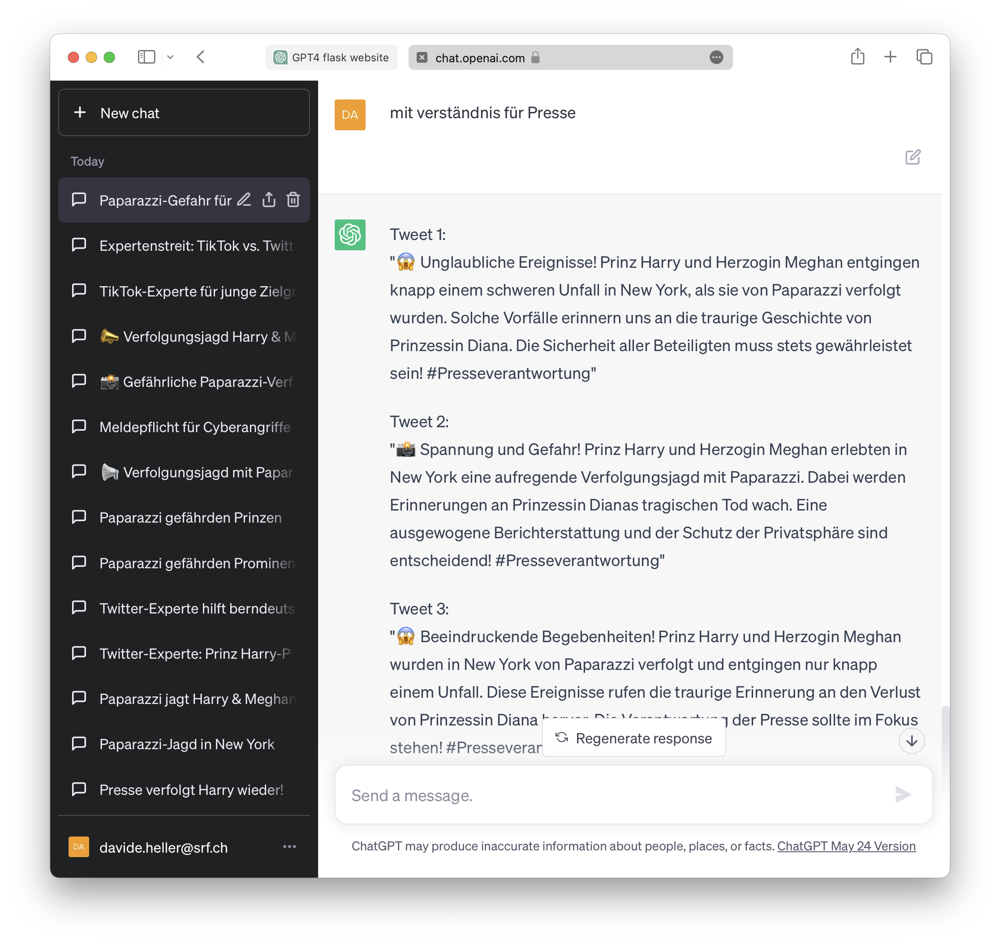

# Post it! (by ChatGPT🤖)

This is a simple [Flask](https://flask.palletsprojects.com/) application that takes user input through a form, stores the form data in a dictionary, and generates a promt message for ChatGPT based on the user input. The application also allows the user to copy the generated message to their clipboard to ease the copy-pasting into ChatGPT.

The project was realized for the SRF ChatGPT Hackathon on 2023-06-03 with the idea to simplify writing Posts for Social Media (Twitter/Instagram etc.) starting from longer Agency Report ([Example](examples/Text.txt)).

## Team members
- Bleuler, Nicole
- Heller, Davide
- Kornacher, Silja
- Kurtogullari, Deniz
- Leiser, Eliane
- Schwerzmann, Jacqueline

## Project Structure

```
├── app.py
├── templates
│ └── form.html
└── static
└── styles.css
└── README.md
└── LICENSE
```


- `app.py` contains the Flask application, including the routes for the form and reset functionality.
- `form.html` is the HTML template for the form and message.
- `styles.css` contains all the styles for the form and message.

## Setup

### Prerequisites

- Python 3.6 or later
- Flask

### Installation

1. Clone the repository:

```bash
git clone https://github.com/mmz-srf/chatgpt-hackday-post-it
```

2. Install Flask:

```bash
pip install flask
```

3. Run the application:

```bash
export FLASK_APP=app.py
flask run
```

## Usage

1. Fill in the form with your data.
2. Click "Submit" to generate the promt message. The form inputs will persist even after the page is reloaded.
3. Click "Copy to Clipboard" to copy the prompt message.
4. Paste your prompt into ChatGPT to obtain the post suggestions.

## License

This project is licensed under the terms of the MIT license.

## Screenshots

With input text [Example](examples/Text.txt)


